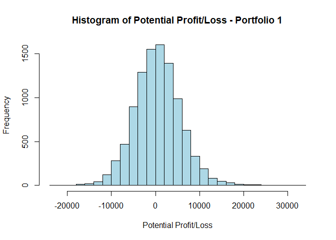
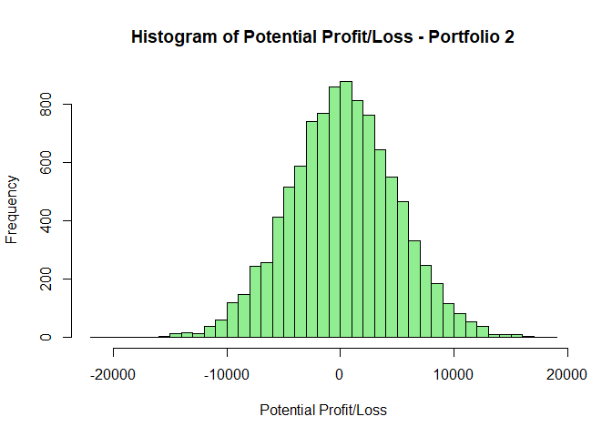
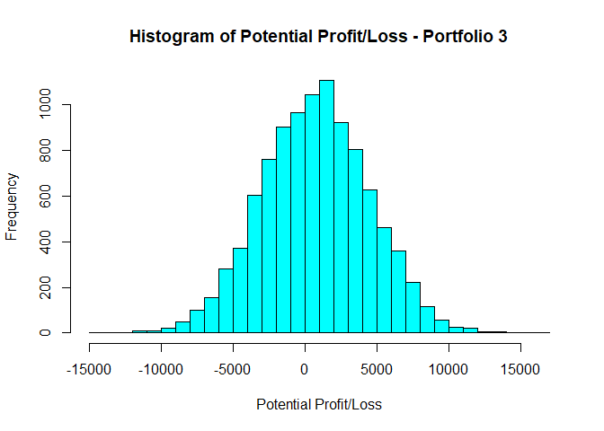

Problem 1. Visual story telling part 1: green buildings
=======================================================

    rm(list=ls())
    green = read.csv("greenbuildings.csv")
    # summary(green)
    library(mosaic)
    library(tidyverse)

We started by checking potential confounders in the dataset and diving
into those that appear to have the potential, namely “age” and
“class\_a.”

    # Check whether age is a plausible confounder
    g = ggplot(green)
    g + geom_histogram(aes(x = age, y=stat(density))) +
      facet_grid(green_rating~.) +
      labs(title="Density Distribution of Property Ages",
           subtitle = "Non-Green vs. Green Properties",
           x ="Property Age",
           y = "Density")

**Comments:** Non-green buildings have two “clusters” of ages - one
similar to those of green buildings (&lt; 50), the other between 75 and
125. Given that green buildings do not have the older “cluster” and new
buildings tend to have higher rents, Age of the properties is a
confounding variable.

    # Try to hold age roughly constant
    # define some age groupings
    green = mutate(green,
                   agecat = cut(age, c(0, 10, 25, 50, 75, 200),include.lowest = TRUE))

    # compare rent within age groupings
    rentByAge = green %>%
      group_by(agecat, green_rating) %>%
      summarize(median_rent = median(Rent), n=n()) # do median to eliminate the effects of outlier

    ggplot(rentByAge) +
      geom_bar(stat = 'identity', aes(x = agecat,
                                      y = median_rent,
                                      fill = factor(green_rating,)),
               position = 'dodge') +
      labs(title="Median Property Rent by Property Age Categories",
           subtitle = "Non-Green vs. Green Properties",
           x ="Property Age Category",
           y = "Median Property Rent ($/sqft)") +
      scale_fill_discrete(name = "Building Rating",
                          labels=c("Non-Green-Rated", "Green-Rated"))

**Comment**: Holding property age constant, the median rents for
green-rated buildings older than 10 years in age do appear to be higher
than those for non-green-rated buildings.

    # Check whether class_a is a plausible confounder
    g = ggplot(green)
    g + geom_bar(aes(factor(class_a), fill =  factor(green_rating)),
               position = 'dodge') +
      labs(title="Numbers of Non-Class A vs. Class A Buildings",
           x ="Non-Class A / Class A",
           y = "Counts") +
      scale_fill_discrete(name = "Building Rating",
                          labels=c("Non-Green-Rated", "Green-Rated"))

**Comment:** Class A seems like a potential confounder as more green
buildings appear to be classified as Class A. Higher-quality properties
tend to translate into higher prices. So the higher average rent
associated with green buildings may be at least partially attributed to
building qualities.

    # Try to hold class-A roughly constant
    rentByclassA = green %>%
      group_by(class_a, green_rating) %>%
      summarize(median_rent = median(Rent), n=n())
    ggplot(rentByclassA) +
      geom_bar(stat = 'identity', aes(x = factor(class_a),
                                      y = median_rent,
                                      fill = factor(green_rating,)),
               position = 'dodge') +
      labs(title="Median Rents for Non-Class A vs. Class A Properties",
           subtitle = "between Non-Green and Green Properties",
           x ="Non-Class A / Class A",
           y = "Average Property Rent ($/sqft)") +
      scale_fill_discrete(name = "Building Rating",
                          labels=c("Non-Green-Rated", "Green-Rated"))

**Comment:** For Class A buildings, the rents of green buildings do not
appear to be statistically different from non-green buildings. However,
for non-Class A buildings, the green-rated buildings do appear to have
higher rents.

**Concluding Thoughts:** One should not simply conclude that green
buildings have higher rents because they are green. In reality, other
factors such as the age and the quality of a property also affect rents.
That said, as seen from the graphs above, when holding the property age
constant, older green buildings do appear to be of higher rents than
non-green buildings, though their rents may be lower during the first
ten years post construction. Moreover, if the client intends to build a
class A property, there is no significant difference in rent between
green and non-green buildings. In conclusion, if the client plans to
build a non-Class-A building, they may expect to charge higher rents in
the long run, but not in the short term.

Problem 2. Visual story telling part 2: flights at ABIA
=======================================================

    # Setup
    rm(list=ls())
    library(mosaic)
    library(tidyverse)

    ABIA = read.csv("ABIA.csv")

    # Get Airline names instead of IATACode
    airlinecode = read.csv("IATA-Airline.csv", sep = ',', header = TRUE)
    ABIAAirline = merge(ABIA, airlinecode, by.x = "UniqueCarrier", by.y = "ï..IATA")

**Thesis:** We would like to explore outbound flight cancellations from
ABIA in 2008. Are there particular airlines that had more cancellations?
Were these cancellations out of their control? We start by level setting
the flight volume by airline, then diving into the cancellation volume,
cancellations as a percentage of total flights, and finally reasons for
cancellations.

    # Dummy variable setup
    n = dim(ABIAAirline)[1]
    CanCarrier = rep(0,n)
    CanCarrier[ABIAAirline$CancellationCode=='A']=1
    CanWeather = rep(0,n)
    CanWeather[ABIAAirline$CancellationCode=='B']=1
    CanNAS = rep(0,n)
    CanNAS[ABIAAirline$CancellationCode=='C']=1

    ABIAAirline['CanCarrier'] = CanCarrier
    ABIAAirline['CanWeather'] = CanWeather
    ABIAAirline['CanNAS'] = CanNAS

    FlightCancellations = ABIAAirline %>%
      filter(Origin == 'AUS') %>%
      group_by(AirlineName) %>%
      summarize(flight_count = n() , # Flights out of AUS by airline
                cancelled_count = sum(Cancelled), # Cancels out of AUS by airline
                cancelRatio = cancelled_count / flight_count, # % cancels out of AUS by airline
                CarrierCancellation = sum(CanCarrier), # reasons for cancels
                WeatherCancellation = sum(CanWeather),
                NASCancellation = sum(CanNAS),
                CarrierCanPerc = round(CarrierCancellation / cancelled_count,3),
                WeatherCanPerc = round(WeatherCancellation / cancelled_count,3),
                NASCanPerc = round(NASCancellation / cancelled_count,3))

    # Plot flight count
    ggplot(FlightCancellations[,1:2]) + geom_bar(stat = 'identity',
                            aes(x = reorder(AirlineName, -flight_count),
                                y = flight_count)) +
      theme(axis.text.x = element_text(angle = 45, hjust = 1)) +
      labs(title="Number of Outbound Flights from AUS, by Airline - 2008",
           x ="Airline",
           y = "Number of Outbound Flights Scheduled")

    # Plot cancel count
    ggplot(FlightCancellations[,c(1,3)]) + geom_bar(stat = 'identity',
                            aes(x = reorder(AirlineName, -cancelled_count),
                                y = cancelled_count)) +
      theme(axis.text.x = element_text(angle = 45, hjust = 1)) +
      labs(title="Number of Outbound Flights Cancelled, by Airline - 2008",
           x ="Airline",
           y = "Number of Flights Cancelled")

    # Plot cancel %
    ggplot(FlightCancellations[,c(1,4)]) + geom_bar(stat = 'identity',
                            aes(x = reorder(AirlineName, -cancelRatio),
                                y = cancelRatio)) +
      theme(axis.text.x = element_text(angle = 45, hjust = 1)) +
      labs(title="Percentage of Outbound Flights Cancelled, by Airline - 2008",
           x ="Airline",
           y = "Percentage of Flights Cancelled")

    # Get Plot 3's order for Plot 4 
    Xorder = reorder(FlightCancellations$AirlineName, -FlightCancellations$cancelRatio)

    # Plot cancellation reasons by airline
    library(reshape2)
    df <- melt(FlightCancellations[c(1,8,9,10)], id.vars = "AirlineName")
    df$value[is.na(df$value)] <- 0
    vec = levels(Xorder)
    df$AirlineName <- factor(df$AirlineName, levels=vec) # reordering the columns as # of delays out
    ggplot(df, aes(x = AirlineName,
                   y = value,
                   fill = variable)) +
      geom_bar(stat = 'identity') +
      theme(axis.text.x = element_text(angle = 45, hjust = 1)) +
      labs(title="AUS Outbound Flight Cancellation Reasons, by Airline - 2008",
           x ="Airline", 
           y = "Percentage of Cancelled Flights") +
      scale_fill_discrete(name = "Cancellation Reason",
                          labels=c("Carrier", "Weather", "NAS"))

**Concluding Thoughts:** As one can see from the first and second plots,
while Southwest flew the most flights out of Austin in 2008 (~70% more
than second place American Airlines), its cancellation volume is about a
third of that of American. In fact, when looking at percentage of
flights cancelled (third plot), Southwest was the fourth lowest. Lastly,
among the five airlines that had the most cancellations by percentage,
only American Eagle and Comair had less than half of the flights
cancelled due to factors outside of their control. Mesa especially had
over 80% of its cancellations due to carrier-controlled factors.

**Food for thought:** Among those with relatively high cancellation
percentages:

-   Pinnacle and Comair are no longer operating
-   American Eagle is part of American Airlines
-   Mesa operates for American Airlines and United Airlines
-   SkyWest operates for American, United, and Alaska

Problem 3. Portfolio modeling
=============================

Portfolio 1:
------------

-   Diversified ETF: GCE (Clymore CEF GS Connect ETN)
-   Health & Biotech: IHI (iShares US Medical Devices ETF)
-   S. America: FBZ (First Trust Brazil Alpha DEX Fund)

<!-- -->

    rm(list=ls())
    library(mosaic)
    library(quantmod)
    library(foreach)

    # Import ETF
    myETF = c("GCE","IHI","FBZ")
    getSymbols(myETF, from = "2014-08-01") # Last five years of data

    ## [1] "GCE" "IHI" "FBZ"

    # Adjust for splits and dividends
    for(ticker in myETF) {
        expr = paste0(ticker, "a = adjustOHLC(", ticker, ")")
        eval(parse(text=expr))
    }
    # head(GCE)

    # Combine, in col, all the returns (close-to-close, 24-hr, changes) in a matrix
    all_returns = cbind(ClCl(GCE),
                                    ClCl(IHI),
                                    ClCl(FBZ))
    # head(all_returns)
    all_returns = as.matrix(na.omit(all_returns)) # drop the first row

    initial_wealth = 100000
    sim1 = foreach(i=1:10000, .combine='rbind') %do% { #for each - rowbind each wealth tracker
        total_wealth = initial_wealth
        weights = c(0.4, 0.3, 0.3)
        holdings = weights * total_wealth
        n_days = 20
        wealthtracker = rep(0, n_days)
        for(today in 1:n_days) {
            return.today = resample(all_returns, 1, orig.ids=FALSE)
            holdings = holdings + holdings*return.today
            total_wealth = sum(holdings)
            wealthtracker[today] = total_wealth
            
            # rebalancing
          weights = c(0.4, 0.3, 0.3)
          holdings = weights * total_wealth
            
        }
        wealthtracker
    }

    # Profit/loss
    mean(sim1[,n_days]) 

    ## [1] 100496.5

    hist(sim1[,n_days]- initial_wealth, breaks=30,
         main = "Histogram of Potential Profit/Loss - Portfolio 1",
         xlab = "Potential Profit/Loss",
         col = "light blue")

    # Calculate VaR
    VaR5 = 100000 - quantile(sim1[,n_days], 0.05)
    VaR5

    ##       5% 
    ## 7860.612

Portfolio 2:
------------

-   Large cap blend ETF: VTV (Vanguard Value ETF)
-   Emerging market: GREK (Global X FTSE Greece 20 ETF)
-   Asia Pacific: THD (iShares MSCI Thailand ETF)
-   Fin. Services: KIE (SPDR S&P Insurance ETF)

<!-- -->

    # Import ETF
    myETF2 = c("VTV","GREK","THD","KIE")
    getSymbols(myETF2, from = "2014-08-01") # Last five years of data

    ## [1] "VTV"  "GREK" "THD"  "KIE"

    # Adjust for splits and dividends
    for(ticker in myETF2) {
        expr = paste0(ticker, "a = adjustOHLC(", ticker, ")")
        eval(parse(text=expr))
    }
    # head(VTV)

    # Combine, in col, all the returns (close-to-close, 24-hr, changes) in a matrix
    all_returns2 = cbind(ClCl(VTV),
                                    ClCl(GREK),
                                    ClCl(THD),
                                    ClCl(KIE))
    # head(all_returns2)
    all_returns2 = as.matrix(na.omit(all_returns2)) # drop the first row

    initial_wealth = 100000
    sim1 = foreach(i=1:10000, .combine='rbind') %do% { #for each - rowbind each wealth tracker
        total_wealth = initial_wealth
        weights = c(0.25, 0.25, 0.25, 0.25)
        holdings = weights * total_wealth
        n_days = 20
        wealthtracker = rep(0, n_days)
        for(today in 1:n_days) {
            return.today = resample(all_returns2, 1, orig.ids=FALSE)
            holdings = holdings + holdings*return.today
            total_wealth = sum(holdings)
            wealthtracker[today] = total_wealth
            
            # rebalancing
          weights = c(0.25, 0.25, 0.25, 0.25)
          holdings = weights * total_wealth
            
        }
        wealthtracker # record wealth of day 20
    }

    # Profit/loss
    mean(sim1[,n_days]) 

    ## [1] 100228.9

    hist(sim1[,n_days]- initial_wealth, breaks=30,
         main = "Histogram of Potential Profit/Loss - Portfolio 2",
         xlab = "Potential Profit/Loss",
         col = "light green")

    # Calculate VaR
    VaR5 = 100000 - quantile(sim1[,n_days], 0.05)
    VaR5

    ##       5% 
    ## 7636.193

Porfolio 3:
-----------

-   Emerging market: FRN (Invesco Frontier markets)
-   Asia Pacific: ENZL (iShares MSCI New Zealand ETF)
-   Technology: VGT (Vanguard Info Tech)

<!-- -->

    # Import ETF
    myETF3 = c("FRN","ENZL","VGT")
    getSymbols(myETF3, from = "2014-08-01") # Last five years of data

    ## [1] "FRN"  "ENZL" "VGT"

    # Adjust for splits and dividends
    for(ticker in myETF3) {
        expr = paste0(ticker, "a = adjustOHLC(", ticker, ")")
        eval(parse(text=expr))
    }
    # head(FRN)

    # Combine, in col, all the returns (close-to-close, 24-hr, changes) in a matrix
    all_returns3 = cbind(ClCl(FRN),
                                    ClCl(ENZL),
                                    ClCl(VGT))
    # head(all_returns3)
    all_returns3 = as.matrix(na.omit(all_returns3)) # drop the first row

    initial_wealth = 100000
    sim1 = foreach(i=1:10000, .combine='rbind') %do% { #for each - rowbind each wealth tracker
        total_wealth = initial_wealth
        weights = c(0.2, 0.4, 0.4)
        holdings = weights * total_wealth
        n_days = 20
        wealthtracker = rep(0, n_days)
        for(today in 1:n_days) {
            return.today = resample(all_returns3, 1, orig.ids=FALSE)
            holdings = holdings + holdings*return.today
            total_wealth = sum(holdings)
            wealthtracker[today] = total_wealth
            
            # rebalancing
          weights = c(0.2, 0.4, 0.4)
          holdings = weights * total_wealth
            
        }
        wealthtracker
    }

    # Profit/loss
    mean(sim1[,n_days]) 

    ## [1] 100723.3

    hist(sim1[,n_days]- initial_wealth, breaks=30,
         main = "Histogram of Potential Profit/Loss - Portfolio 3",
         xlab = "Potential Profit/Loss",
         col = "cyan")

    # Calculate VaR
    VaR5 = 100000 - quantile(sim1[,n_days], 0.05)
    VaR5

    ##       5% 
    ## 5401.337

**Report:** Below is a brief description of each of our ETF portfolios,
along with their values at right at the 5% level according to our
simulations. The first two portfolios have relatively similar VaR at
over $7k. Portfolio 3 is safer than the other two, at under $5.5k of
VaR. Note that given the above resampling was generated from Monte Carlo
simulations, our answers will not be exactly replicable based on the
code above.

**Portfolio 1:** Medium-High aggressiveness - This portfolio contains

1.  Clymore CEF GS Connect ETN, a currently high-performing diversified
    ETF (i.e., it has the highest YTD growth among all diversified
    ETFs). Diversified ETFs are generally safer, though we increased the
    aggressiveness by choosing the one with the highest YTD growth.
2.  iShares US Medical Devices ETF, a health & biotech ETF. The US
    health industry is one of the most lucrative in the world (albeit at
    the detriment of the American people) and continues to grow. While
    the volatility is high, the upside is as well.
3.  First Trust Brazil Apha DEX Fund, a South American ETF. We decided
    to ensure more than one geography in each portfolio to guard against
    potential recession in any region, and picked a Brazilian one to go
    with the US for Portfolio 1. Though many still see Brazil as an
    emerging market, this particular ETF has been churning out high
    returns in recent years. Therefore, we believe it is a safe option
    to add to the portfolio.

This portfolio has a 5% VaR a bit under $7.9k and the distribution of
its returns is wide.

**Portfolio 2:** High aggressiveness - This portfolio contains

1.  Vanguard Value ETF, a Large cap blend ETF. We have three other
    aggressive ETFs in this portfolio, so included a large cap/growth
    and value ETF to have a more reliable component for the portfolio.
2.  GREK (Global X FTSE Greece 20 ETF), an emerging market ETF. Greece,
    stabilizing post the bankruptcy and Grexit crisis, provides a good
    opportunity for high returns, though the risks are high as well.
3.  iShares MSCI Thailand ETF, an Asia Pacific ETF. We added a
    different, yet still highly volatile geography into the mix.
4.  SPDR S&P Insurance ETF, a financial services ETF. The financial
    services industry in general is highly lucrative, though the risks
    can be high as well (read: cause of the 2008 recession, high
    insurance losses from numerous natural disasters). We decided to
    include it, again, to be aggressive with the potential high returns.

This portfolio has a 5% VaR a bit over $7.4k, and the distribution of
its returns is similar but slightly more concentrated than Portfolio 1.

**Portfolio 3:** Safe - This portfolio contains 1. iShares MSCI New
Zealand ETF, an Asia Pacific ETF. This is a safe bet on a developed
country with steady growth. 2. Invesco Frontier markets, an emerging
market ETF. This is the only semi-aggressive ETF in the portfolio. That
said, it is not focused on one single emerging market, so the risks are
still diversified. 3. Vanguard Information Technology, a technology ETF.
Technology is the present and the future. Including a technology ETF is
vital in capturing and profiting from the growth of the world.

This portfolio has a 5% VaR of under $5.3k and the distribution of its
returns is noticeably more concentrated than the two portfolios above.

Problem 4. Market segmentation
==============================

    rm(list=ls())
    library(ggplot2)
    library(LICORS)  # for kmeans++
    library(foreach)
    library(mosaic)

    social = read.csv('social_marketing.csv', header=TRUE)

    x = social[,-1] #removes the first column

**Note:** Because the numbers of tweets by users vary greatly, we
decided to scale the dataset by determining the proportions of each
user’s tweets that belong to different categories. That is, we want to
use the % of tweets in each category rather than the absolute counts to
cluster.

    X = x/rowSums(x)

**k-means clustering**

**Choosing K**

    k_grid = seq(2, 15, by = 1)
    SSE_grid = foreach(k = k_grid, .combine = 'c') %do%
      {
        cluster_k = kmeanspp(X, k, nstart = 50)
        cluster_k$tot.withinss
      }

    plot(k_grid, SSE_grid)

    # K = 7 looks like the elbow

    # Using kmeans++ initialization with 7 clusters
    set.seed(10)
    clust2 = kmeanspp(X, k=7, nstart=50)
    clust2$centers

    ##      chatter current_events     travel photo_sharing uncategorized
    ## 1 0.07677266     0.03454619 0.02685292    0.04017548    0.01940061
    ## 2 0.09726093     0.06111745 0.04712967    0.04975079    0.03673647
    ## 3 0.08065045     0.03930292 0.08995848    0.03821091    0.01794340
    ## 4 0.07680646     0.03874510 0.02588941    0.04104678    0.01650558
    ## 5 0.07992847     0.03193644 0.02875994    0.04763627    0.01738807
    ## 6 0.07297447     0.03637618 0.02857758    0.09574802    0.02233269
    ## 7 0.24029440     0.05484896 0.03499178    0.12131898    0.02495694
    ##      tv_film sports_fandom   politics       food     family
    ## 1 0.01737646    0.02233951 0.02223362 0.03749700 0.01446296
    ## 2 0.07442123    0.02771083 0.02539880 0.02855757 0.01807483
    ## 3 0.02254455    0.04375804 0.15484337 0.02468965 0.01875494
    ## 4 0.01808430    0.11052033 0.01851078 0.08201691 0.04649887
    ## 5 0.02421170    0.02380386 0.02012666 0.02341523 0.01988005
    ## 6 0.01592520    0.01988144 0.01931440 0.01751907 0.01472571
    ## 7 0.02019522    0.02596722 0.03012559 0.01862833 0.02091444
    ##   home_and_garden      music       news online_gaming   shopping
    ## 1      0.01202962 0.01335322 0.01956643    0.01637570 0.02188338
    ## 2      0.01941604 0.02779711 0.02124041    0.01752705 0.02764997
    ## 3      0.01230270 0.01271554 0.10175879    0.01397165 0.01753607
    ## 4      0.01255777 0.01426978 0.01620151    0.01545007 0.02189573
    ## 5      0.01119192 0.01253074 0.01323330    0.17843770 0.01833002
    ## 6      0.01191760 0.01993107 0.01438429    0.01589280 0.02699315
    ## 7      0.01545597 0.01796103 0.01387401    0.01519057 0.07016288
    ##   health_nutrition college_uni sports_playing    cooking         eco
    ## 1       0.21671098  0.01599393     0.01224264 0.05557171 0.015593603
    ## 2       0.02095615  0.04600860     0.01723630 0.01922111 0.014019096
    ## 3       0.01995962  0.01919527     0.01195992 0.01810022 0.009274309
    ## 4       0.02274450  0.01679587     0.01274007 0.01945934 0.012406587
    ## 5       0.02230930  0.18922953     0.04269272 0.02201772 0.008543361
    ## 6       0.02803988  0.02110110     0.01357590 0.18950095 0.008976371
    ## 7       0.02162757  0.02123662     0.01370180 0.01987762 0.015111763
    ##     computers    business   outdoors      crafts automotive         art
    ## 1 0.010165845 0.007878379 0.04380997 0.010245425 0.01116318 0.012644172
    ## 2 0.012117665 0.014689449 0.01525257 0.016476752 0.01627938 0.047274204
    ## 3 0.035772062 0.010578269 0.01724355 0.010327248 0.04633045 0.009520355
    ## 4 0.013397446 0.009116653 0.01179156 0.017273178 0.01913820 0.012787199
    ## 5 0.009398171 0.007379090 0.01043721 0.009354959 0.01505526 0.019774941
    ## 6 0.011630346 0.009180693 0.01353622 0.009245801 0.01291096 0.013656519
    ## 7 0.014009646 0.012635290 0.00926237 0.012380264 0.01911280 0.008461305
    ##     religion      beauty  parenting      dating      school
    ## 1 0.01395865 0.008450889 0.01276188 0.016303076 0.010215000
    ## 2 0.01900443 0.014274846 0.01408414 0.029607225 0.016982793
    ## 3 0.01624773 0.008110217 0.01686959 0.014960133 0.012590558
    ## 4 0.09116630 0.017651856 0.06871207 0.010274490 0.044504005
    ## 5 0.01147869 0.007519962 0.01242132 0.011296043 0.009224471
    ## 6 0.01414612 0.060834696 0.01285687 0.009528852 0.015726423
    ## 7 0.01106146 0.009399047 0.01248186 0.014819006 0.014973526
    ##   personal_fitness     fashion small_business         spam       adult
    ## 1       0.10921876 0.012564505    0.005141202 7.978964e-05 0.004420663
    ## 2       0.01602209 0.018602038    0.013811051 5.212482e-04 0.037769706
    ## 3       0.01355091 0.009738987    0.007778548 9.325976e-05 0.002857334
    ## 4       0.01657562 0.014949975    0.007409727 6.020845e-05 0.006045755
    ## 5       0.01529368 0.012636260    0.007459737 1.957139e-04 0.005471466
    ## 6       0.01777459 0.092977391    0.007256422 2.834024e-05 0.005021892
    ## 7       0.01744707 0.014289624    0.009326927 7.648706e-05 0.003821608

    clust2$size/7882

    ## [1] 0.16911951 0.15630551 0.13562548 0.13067749 0.07066734 0.09667597
    ## [7] 0.24092870

**Market Segment Identification:** We clustered NutrientH2O’s social
media audience into seven clusters based on the percentage of tweets
each user had in each category. Each cluster has at least 7% of the
audience sample; so we feel each cluster is meaningful. We identified
the following segments amongst the audience:

1.  **The Health Gurus:** This segment (17% of the sample) is
    particularly interested in health\_nutrition (22%) and personal
    fitness (11%). They also often discuss cooking (6%) and outdoors
    (4%).
2.  **Regular College Kids:** This segment (16% of the sample) discusses
    a healthy amount of tv & film (7%), current events (6%), college
    events (5%), art (5%), music (3%), and dating (3%)
3.  **The Worldly:** This segment (14% of the sample) includes those who
    regularly discuss politics (15)%, news (10%), and travel (9%).
    Interestingly, they also discuss more automative (5%) and computers
    (4%) than other segments.
4.  **Middle America:** This segment (14% of the sample) includes those
    who are particularly interested in watching sports (11% of tweets),
    religion (9%), and parenting (7%).
5.  **College Gamers:** This segment (7% of the sample) often discusses
    online gaming (18%) and college-related events (19%).
6.  **The Social Media Influencers:** This segment (10% of the sample)
    often tweets about cooking (19%), photo sharing (10%), fashion (9%),
    and beauty (6%).
7.  **The Others:** This segment (24% of the sample) does not have many
    targeted interests. That said, they have many chatter tweets (24%),
    often shares photos (12%),and discuss a healthy amount of current
    events (5%) and shopping (7%).

Problem 5. Author attribution
=============================

    # Setup
    rm(list = ls())
    library(tm) 
    library(magrittr)
    library(slam)
    library(proxy)

    readerPlain = function(fname){
      readPlain(elem=list(content=readLines(fname)), 
               id=fname, language='en') }

Prepare training set

    # Read in files
    dir.list = list.files('ReutersC50/C50train/')
    file_list2 = c()
    authors = c()
    for (x in dir.list){
      # read files into one DF, ensure to set up an author vector for response variable
      files = Sys.glob(paste('ReutersC50/C50train/', x,'/*.txt', sep=''))
      file_list2 = c(file_list2, files)
      authors = c(authors, rep(x,50))
    }

    # clean up file names
    all.authors = lapply(file_list2, readerPlain) 
    mynames = file_list2 %>%
    { strsplit(., '/', fixed=TRUE) } %>%
    { lapply(., tail, n=2) } %>%
    { lapply(., paste0, collapse = '') } %>%
      unlist

    # Rename all files
    names(all.authors) = mynames

Set up document term matrix

    # create a text mining corpus with the plain docs 
    documents_raw = Corpus(VectorSource(all.authors))

    # Pre-processing/tokenization step
    my_documents = documents_raw
    my_documents = tm_map(my_documents, content_transformer(tolower)) # make everything lowercase
    my_documents = tm_map(my_documents, content_transformer(removeNumbers)) # remove numbers
    my_documents = tm_map(my_documents, content_transformer(removePunctuation)) # remove punctuation
    my_documents = tm_map(my_documents, content_transformer(stripWhitespace)) # remove excess white-space
    my_documents = tm_map(my_documents, content_transformer(removeWords), stopwords("en")) # Remove stop words

    # create a doc-term-matrix
    DTM_all.authors = DocumentTermMatrix(my_documents)
    # DTM_all.authors # some basic summary statistics; ~#32.6k terms
    DTM_all.authors = removeSparseTerms(DTM_all.authors, 0.95) # remove words not used in > 5% of docs
    DTM_all.authors # now 801 terms

    ## <<DocumentTermMatrix (documents: 2500, terms: 801)>>
    ## Non-/sparse entries: 280686/1721814
    ## Sparsity           : 86%
    ## Maximal term length: 18
    ## Weighting          : term frequency (tf)

Construct TF-IDF weights

    tfidf_all.authors = weightTfIdf(DTM_all.authors)

Train a Random Forest model

    library(stringr)
    library(klaR)
    library(caret)
    library(randomForest)

    adtm.df<-as.data.frame(as.matrix(tfidf_all.authors))
    adtm.df$authors=authors # add the response variable to the df
    names(adtm.df) <- make.names(names(adtm.df))
    set.seed(10)
    model2 <- randomForest(as.factor(authors)~., data = adtm.df, ntree = 1000, mtry = 10, importance = TRUE)

Set up the test set - same steps as for the training set

    dir.list = list.files('ReutersC50/C50test/')
    file_list3 = c()
    authors2 = c()
    for (x in dir.list){
      files = Sys.glob(paste('ReutersC50/C50test/', x,'/*.txt', sep=''))
      file_list3 = c(file_list3, files)
      authors2 = c(authors2, rep(x,50))
    }

    all.authors2 = lapply(file_list3, readerPlain)
    mynames = file_list3 %>%
      { strsplit(., '/', fixed=TRUE) } %>%
      { lapply(., tail, n=2) } %>%
      { lapply(., paste0, collapse = '') } %>%
      unlist

    # Rename the articles
    names(all.authors2) = mynames

    # Create a text mining corpus with the plain docs
    documents_raw = Corpus(VectorSource(all.authors2))

    # Pre-processing/tokenization steps
    my_documents = documents_raw
    my_documents = tm_map(my_documents, content_transformer(tolower)) # make everything lowercase
    my_documents = tm_map(my_documents, content_transformer(removeNumbers)) # remove numbers
    my_documents = tm_map(my_documents, content_transformer(removePunctuation)) # remove punctuation
    my_documents = tm_map(my_documents, content_transformer(stripWhitespace)) # remove excess white-space
    my_documents = tm_map(my_documents, content_transformer(removeWords), stopwords("en")) # remove stop words

Create a doc-term-matrix for the test set

    DTM_all.authors2 = DocumentTermMatrix(my_documents)
    # DTM_all.authors2 # ~33.4K terms
    DTM_all.authors2 = removeSparseTerms(DTM_all.authors2, 0.95) # remove words not used in > 5% of docs
    DTM_all.authors2 # now ~ 816 terms

    ## <<DocumentTermMatrix (documents: 2500, terms: 816)>>
    ## Non-/sparse entries: 285048/1754952
    ## Sparsity           : 86%
    ## Maximal term length: 18
    ## Weighting          : term frequency (tf)

**Note:** unlike Naive Bayes, Random Forest does not assume independence
and compound probabilities. Therefore, terms not in the training set are
simply not considered in the model and do not affect the existing terms’
predictive power. As such, we did not set up a pseudo-word count for our
model.

Construct TF-IDF weights

    tfidf_all.authors2 = weightTfIdf(DTM_all.authors2)
    tfidf_all.authors2

    ## <<DocumentTermMatrix (documents: 2500, terms: 816)>>
    ## Non-/sparse entries: 245048/1794952
    ## Sparsity           : 88%
    ## Maximal term length: 18
    ## Weighting          : term frequency - inverse document frequency (normalized) (tf-idf)

Set up test set data frame and predict

    adtm.df_test2<-as.data.frame(as.matrix(tfidf_all.authors2))
    rf.pred = predict(model2, data=adtm.df_test2)
    mean(rf.pred==authors2) #80.32% accuracy

    ## [1] 0.8032

Deeper dive into model performance

    rf.confusion.matrix = confusionMatrix(table(rf.pred,authors2))
    rf.confusion.matrix$overall # again, 80.32% accuracy

    ##       Accuracy          Kappa  AccuracyLower  AccuracyUpper   AccuracyNull 
    ##      0.8032000      0.7991837      0.7870638      0.8186227      0.0200000 
    ## AccuracyPValue  McnemarPValue 
    ##      0.0000000            NaN

    rf.confusion.matrix.df = as.data.frame(rf.confusion.matrix$byClass)
    rf.confusion.matrix.df[order(-rf.confusion.matrix.df$Sensitivity),1:2]

    ##                          Sensitivity Specificity
    ## Class: JimGilchrist             1.00   0.9938776
    ## Class: RogerFillion             1.00   0.9979592
    ## Class: FumikoFujisaki           0.98   0.9987755
    ## Class: LynneO'Donnell           0.98   0.9963265
    ## Class: LynnleyBrowning          0.98   0.9987755
    ## Class: AaronPressman            0.96   0.9975510
    ## Class: MatthewBunce             0.96   0.9971429
    ## Class: DarrenSchuettler         0.94   0.9975510
    ## Class: JoWinterbottom           0.94   0.9946939
    ## Class: MarcelMichelson          0.92   0.9971429
    ## Class: NickLouth                0.92   0.9971429
    ## Class: PeterHumphrey            0.92   0.9893878
    ## Class: DavidLawder              0.90   0.9963265
    ## Class: HeatherScoffield         0.90   0.9995918
    ## Class: KouroshKarimkhany        0.90   0.9914286
    ## Class: LydiaZajc                0.90   0.9983673
    ## Class: RobinSidel               0.90   0.9967347
    ## Class: JanLopatka               0.88   0.9942857
    ## Class: KarlPenhaul              0.88   0.9955102
    ## Class: MarkBendeich             0.88   0.9963265
    ## Class: AlanCrosby               0.86   0.9987755
    ## Class: GrahamEarnshaw           0.84   0.9955102
    ## Class: KevinDrawbaugh           0.82   0.9926531
    ## Class: KeithWeir                0.80   0.9983673
    ## Class: KirstinRidley            0.80   0.9975510
    ## Class: PierreTran               0.80   0.9979592
    ## Class: SarahDavison             0.80   0.9967347
    ## Class: SimonCowell              0.80   0.9951020
    ## Class: TimFarrand               0.80   0.9946939
    ## Class: JoeOrtiz                 0.78   0.9967347
    ## Class: JohnMastrini             0.78   0.9967347
    ## Class: JonathanBirt             0.78   0.9946939
    ## Class: KevinMorrison            0.78   0.9967347
    ## Class: ToddNissen               0.78   0.9963265
    ## Class: AlexanderSmith           0.74   0.9979592
    ## Class: BernardHickey            0.74   0.9971429
    ## Class: EricAuchard              0.74   0.9975510
    ## Class: TheresePoletti           0.74   0.9930612
    ## Class: BenjaminKangLim          0.72   0.9828571
    ## Class: MartinWolk               0.72   0.9979592
    ## Class: MichaelConnor            0.72   0.9987755
    ## Class: PatriciaCommins          0.70   0.9967347
    ## Class: SamuelPerry              0.70   0.9951020
    ## Class: BradDorfman              0.68   0.9967347
    ## Class: EdnaFernandes            0.68   0.9967347
    ## Class: TanEeLyn                 0.54   0.9975510
    ## Class: WilliamKazer             0.54   0.9930612
    ## Class: JaneMacartney            0.52   0.9975510
    ## Class: MureDickie               0.50   0.9914286
    ## Class: ScottHillis              0.32   0.9955102

**Report:** To predict authorship based on an article’s textual content,
we relied on term TF-IDFs as the predictors and tested several Random
Forest models. We reached the best accuracy of 80% with 1000 trees and
10 variables. Our data pre-processing and analysis pipeline is as
followed (the same steps were followed for both training and test data):

1.  Read the file names and author names in as two vectors
2.  Clean up each file’s name by splitting the file on “/,” keeping only
    the last two parts of the name (Author Name and unique identifier),
    and concatenate those two parts
3.  Read the files with the readPlain function and name each file the
    cleaned version of its name (from Step 2)
4.  Turn the plain documents into a vector then a corpus for text mining
5.  Tokenize the symbols in the corpus by
    1.  Making everything lowercase
    2.  Removing numbers
    3.  Removing punctuations
    4.  Removing excess white spaces
    5.  Removing stop words
6.  Create a document term matrix (DTM) and remove words that are not
    used in over 5% of the documents in the corpus
7.  Calculate the TF-IDF for each term in each document of the DTM with
    the weightTfIdf function – the TF-IDF weights would serve as the
    features for our Random Forest models. We use the training set’s
    TF-IDF weights to train the model. Then use the model on the test
    set’s TF-IDF weights to predict authorship.

As mentioned above, our best Random Forest model had 1000 trees and
sampled 10 variables at each split. The model reached an overall
accuracy of 80%. Additionally, when predicting for a specific author,
our model’s precision (specificity) is generally over 99%. That said,
some authors’ recalls (sensitivity, or true positives out of all
positives) were especially bad. For example, the model only identified
about a third of all Scott Hillis’ articles.

Problem 6. Association rule mining
==================================

We first read in the data and create the appropriate model

    rm(list=ls())
    library(tidyverse)
    library(arules)
    library(arulesViz)
    groceries <- read.transactions('groceries.txt', sep=',')
    groceries_trans = as(groceries, "transactions")
    grocery_rules = apriori(groceries, 
                         parameter=list(support=.005, confidence=.1, maxlen=3))

    ## Apriori
    ## 
    ## Parameter specification:
    ##  confidence minval smax arem  aval originalSupport maxtime support minlen
    ##         0.1    0.1    1 none FALSE            TRUE       5   0.005      1
    ##  maxlen target   ext
    ##       3  rules FALSE
    ## 
    ## Algorithmic control:
    ##  filter tree heap memopt load sort verbose
    ##     0.1 TRUE TRUE  FALSE TRUE    2    TRUE
    ## 
    ## Absolute minimum support count: 49 
    ## 
    ## set item appearances ...[0 item(s)] done [0.00s].
    ## set transactions ...[169 item(s), 9835 transaction(s)] done [0.00s].
    ## sorting and recoding items ... [120 item(s)] done [0.00s].
    ## creating transaction tree ... done [0.00s].
    ## checking subsets of size 1 2 3 done [0.00s].
    ## writing ... [1534 rule(s)] done [0.00s].
    ## creating S4 object  ... done [0.00s].

We can then run various imspections to get a clearer idea of the
associations. We also look at different subsets, controlling for lift,
confidence, and both lift and confidence.

We then plot the confidence, support, and lift to visualize the spreads
of the metrics and see if there are relationships among them.

    plot(grocery_rules)

Based on the graph showing the spreads of support, confidence, and lift
above, we decided to

-   not filter by support, as most data points have lower than 0.05
    support
-   filter for &gt; 0.5 in confidence, which should still leave a decent
    sample size of data points, then
-   further filter for &gt; 3 in lift to ensure meaningful rules

We then use the filters and plot the association map below.

    sub1 = subset(grocery_rules, subset=confidence > 0.50 & lift > 2.5)
    inspect(sub1)

    ##      lhs                        rhs                    support confidence     lift count
    ## [1]  {onions,                                                                           
    ##       root vegetables}       => {other vegetables} 0.005693950  0.6021505 3.112008    56
    ## [2]  {onions,                                                                           
    ##       whole milk}            => {other vegetables} 0.006609049  0.5462185 2.822942    65
    ## [3]  {chicken,                                                                          
    ##       root vegetables}       => {other vegetables} 0.005693950  0.5233645 2.704829    56
    ## [4]  {frozen vegetables,                                                                
    ##       root vegetables}       => {other vegetables} 0.006100661  0.5263158 2.720082    60
    ## [5]  {curd,                                                                             
    ##       tropical fruit}        => {yogurt}           0.005287239  0.5148515 3.690645    52
    ## [6]  {curd,                                                                             
    ##       tropical fruit}        => {other vegetables} 0.005287239  0.5148515 2.660833    52
    ## [7]  {curd,                                                                             
    ##       root vegetables}       => {other vegetables} 0.005490595  0.5046729 2.608228    54
    ## [8]  {pork,                                                                             
    ##       root vegetables}       => {other vegetables} 0.007015760  0.5149254 2.661214    69
    ## [9]  {margarine,                                                                        
    ##       root vegetables}       => {other vegetables} 0.005897306  0.5321101 2.750028    58
    ## [10] {butter,                                                                           
    ##       whipped/sour cream}    => {other vegetables} 0.005795628  0.5700000 2.945849    57
    ## [11] {butter,                                                                           
    ##       whipped/sour cream}    => {whole milk}       0.006710727  0.6600000 2.583008    66
    ## [12] {butter,                                                                           
    ##       tropical fruit}        => {other vegetables} 0.005490595  0.5510204 2.847759    54
    ## [13] {butter,                                                                           
    ##       root vegetables}       => {other vegetables} 0.006609049  0.5118110 2.645119    65
    ## [14] {butter,                                                                           
    ##       yogurt}                => {whole milk}       0.009354347  0.6388889 2.500387    92
    ## [15] {newspapers,                                                                       
    ##       root vegetables}       => {other vegetables} 0.005998983  0.5221239 2.698417    59
    ## [16] {domestic eggs,                                                                    
    ##       whipped/sour cream}    => {other vegetables} 0.005083884  0.5102041 2.636814    50
    ## [17] {domestic eggs,                                                                    
    ##       root vegetables}       => {other vegetables} 0.007320793  0.5106383 2.639058    72
    ## [18] {fruit/vegetable juice,                                                            
    ##       root vegetables}       => {other vegetables} 0.006609049  0.5508475 2.846865    65
    ## [19] {pip fruit,                                                                        
    ##       whipped/sour cream}    => {other vegetables} 0.005592272  0.6043956 3.123610    55
    ## [20] {pip fruit,                                                                        
    ##       whipped/sour cream}    => {whole milk}       0.005998983  0.6483516 2.537421    59
    ## [21] {citrus fruit,                                                                     
    ##       whipped/sour cream}    => {other vegetables} 0.005693950  0.5233645 2.704829    56
    ## [22] {tropical fruit,                                                                   
    ##       whipped/sour cream}    => {other vegetables} 0.007829181  0.5661765 2.926088    77
    ## [23] {pip fruit,                                                                        
    ##       root vegetables}       => {other vegetables} 0.008134215  0.5228758 2.702304    80
    ## [24] {pastry,                                                                           
    ##       root vegetables}       => {other vegetables} 0.005897306  0.5370370 2.775491    58
    ## [25] {citrus fruit,                                                                     
    ##       root vegetables}       => {other vegetables} 0.010371124  0.5862069 3.029608   102
    ## [26] {root vegetables,                                                                  
    ##       shopping bags}         => {other vegetables} 0.006609049  0.5158730 2.666112    65
    ## [27] {root vegetables,                                                                  
    ##       tropical fruit}        => {other vegetables} 0.012302999  0.5845411 3.020999   121
    ## [28] {rolls/buns,                                                                       
    ##       root vegetables}       => {other vegetables} 0.012201322  0.5020921 2.594890   120

    plot(sub1, method='graph')

**Rule Interpretation:** Among the 28 rules we generated (i.e., those
we’re confident in and have high lifts), most have “other vegetables” on
the right-hand side, while three have “whole milk” and one has “yogurt.”
As can be seen from the graph above - The “other vegetables” rules make
general sense as the other vegetables are usually connected with
specific vegetables and fruits (additionally, they are generally in the
same section at a grocery story), which are always in the left-hand side
of the rules predicting “other vegetables.” - The “whole milk” rules
also make sense. “Whole milk” is connected to many dairy products in the
graph above, understandably as most people who cook with dairy products
require many types of such products. And as expected, all rules have
some sort of dairy product on the left-hand side. - Lastly, the “yogurt”
rule (predicted from curd and tropical fruit) makes sense as curd is
also a dairy product, connected to yogurt in the graph above, and people
often put fruits with their yogurt.
